# Tailgate

A public ingress gateway for home lab services running on Tailscale. Traffic enters via public HTTPS, is terminated by Caddy, and routed over Tailscale to backend services.

## Why?

Running a public-facing reverse proxy from a residential IP has drawbacks:
- ISP IP changes break DNS
- Home network exposed to internet traffic
- Uptime tied to home infrastructure

Moving the ingress to a cheap VPS ($6/mo) solves this while keeping all services safely inside a Tailscale network.

## Before & After

### Before: Caddy at home



Public traffic hits a residential IP. If the home network goes down or the ISP changes the IP, everything breaks.

### After: Caddy on Vultr VPS


Public traffic hits a stable VPS with a static IP. Home services remain hidden inside the Tailscale network, accessible only via encrypted tunnels.

## Architecture

- **Provider:** Vultr (Atlanta region)
- **OS:** Ubuntu 24.04 LTS
- **Reverse Proxy:** Caddy (automatic HTTPS)
- **VPN:** Tailscale (MagicDNS for backend resolution)
- **Optimization:** TCP BBR congestion control

## Prerequisites

1. **Vultr account** with API key exported:
   ```bash
   export VULTR_API_KEY="your-api-key"
   ```

2. **mise** installed ([https://mise.jdx.dev](https://mise.jdx.dev))

3. **Tailscale auth key** from [https://login.tailscale.com/admin/settings/keys](https://login.tailscale.com/admin/settings/keys)
   - Recommended: Reusable, tagged `tag:server`

4. **Porkbun API keys** (if using Porkbun for DNS):
   ```bash
   export PORKBUN_API_KEY="your-api-key"
   export PORKBUN_SECRET_KEY="your-secret-key"
   ```

## Quick Start

```bash
# 1. Install vultr-cli via mise
mise install

# 2. Provision the VPS
mise run provision

# 3. Wait for VPS to become ready, note the ID and IP
mise run wait-ready

# 4. Update mise.toml with VPS_ID and VPS_IP from step 3

# 5. Configure the system (updates, BBR, Tailscale, Caddy, firewall)
mise run configure

# 6. Set your Tailscale auth key and connect
export TS_AUTHKEY="tskey-auth-..."
mise run tailscale-up

# 7. Deploy your Caddyfile
mise run setup-caddy

# 8. Update DNS records
mise run dns-check    # Preview changes
mise run dns-update   # Apply changes

# 9. Verify everything works
mise run verify
```

## Available Tasks

| Task | Description |
|------|-------------|
| `mise run provision` | Create Vultr VPS instance |
| `mise run wait-ready` | Wait for VPS to become active |
| `mise run ssh` | SSH into the VPS |
| `mise run configure` | Full system setup (updates, BBR, Tailscale, Caddy, firewall) |
| `mise run tailscale-up` | Authenticate Tailscale (requires `TS_AUTHKEY`) |
| `mise run setup-caddy` | Deploy Caddyfile to VPS |
| `mise run verify` | Run health checks |
| `mise run dns-check` | Preview DNS changes (dry run) |
| `mise run dns-update` | Apply DNS changes via Porkbun API |
| `mise run destroy` | Delete the VPS (destructive!) |

## Configuration

### Environment Variables

Set these in `mise.toml` after provisioning:

```toml
[env]
VPS_REGION = "atl"
VPS_PLAN = "vhf-1c-1gb"
VPS_OS = "2284"  # Ubuntu 24.04 LTS x64
VPS_LABEL = "ingress-gateway"
VPS_SSH_KEY = "your-ssh-key-id"

# Set after provisioning
VPS_ID = "..."
VPS_IP = "..."
```

### Caddyfile

The default Caddyfile in `setup-caddy` is configured for:

- **ricon.family** - Main website + Matrix well-known endpoints
- **matrix.ricon.family** - Synapse homeserver (port 443)
- **ricon.family:8448** - Matrix federation
- **or-ricon.com** - Secondary website

Backend services are referenced by their **Tailscale hostnames** (e.g., `synapse`, `ricon-family-website`). Caddy resolves these via Tailscale's MagicDNS.

To customize, edit the Caddyfile in the `setup-caddy` task in `mise.toml`.

### Firewall

The `configure` task automatically opens:

| Port | Purpose |
|------|---------|
| 22 | SSH |
| 80 | HTTP (ACME challenges) |
| 443 | HTTPS |
| 8448 | Matrix federation |

## Troubleshooting

### Certificate errors / ACME failures

**Symptom:** Caddy logs show "Timeout during connect (likely firewall problem)"

**Cause:** Firewall not allowing HTTP/HTTPS traffic

**Fix:**
```bash
ssh root@$VPS_IP "ufw allow 80/tcp && ufw allow 443/tcp && ufw --force enable"
systemctl restart caddy
```

### DNS not resolving to new IP

**Symptom:** ACME challenges hitting old IP address

**Cause:** DNS propagation delay (can take minutes to hours)

**Fix:** Wait for propagation, or check with:
```bash
dig +short yourdomain.com
```

### Caddy can't reach backend services

**Symptom:** 502 Bad Gateway errors

**Cause:** Tailscale not connected or backend service hostname not resolvable

**Fix:**
```bash
# Check Tailscale status on VPS
ssh root@$VPS_IP "tailscale status"

# Test backend connectivity
ssh root@$VPS_IP "tailscale ping your-backend-hostname"
```

### Finding your SSH key ID

```bash
vultr-cli ssh-key list
```

### Finding OS IDs

```bash
vultr-cli os list | grep -i ubuntu
```

## Cleanup

To destroy the VPS:

```bash
mise run destroy
```

This will prompt for confirmation before deleting.
